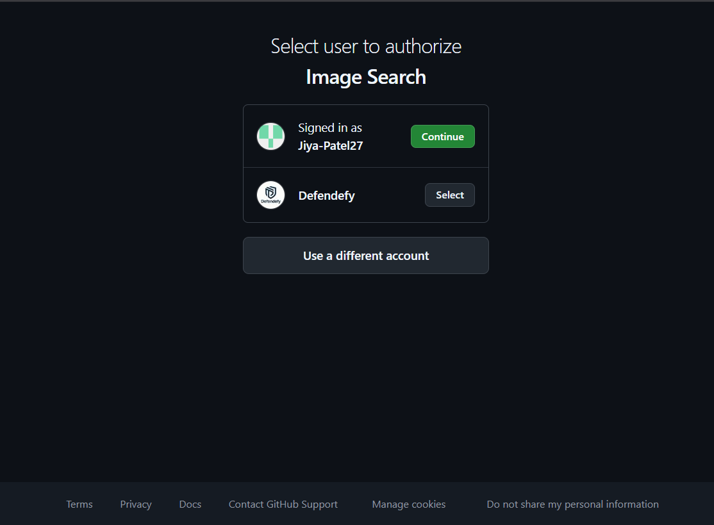
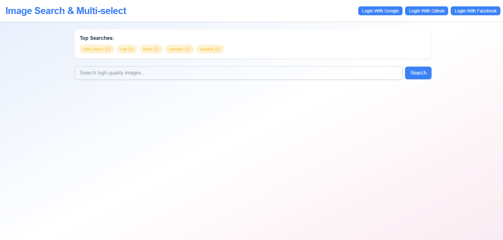
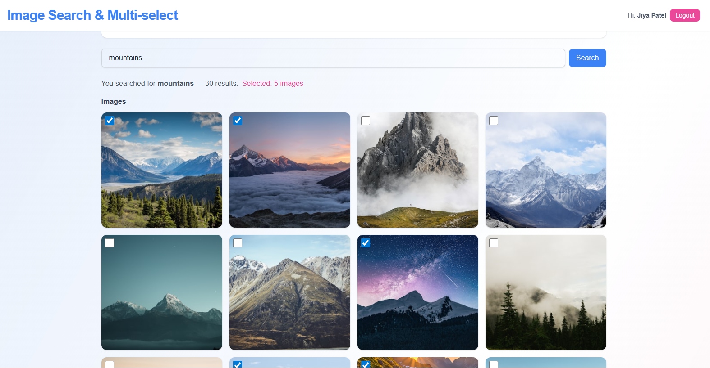
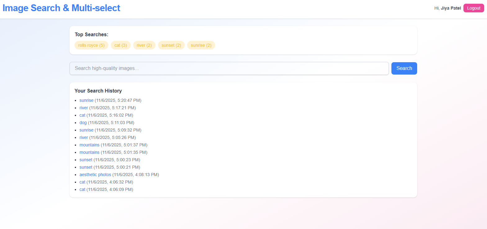

# 🌐 MERN + OAuth Project — Image Search & Multi-Select

This is a full-stack project built using the **MERN stack** (MongoDB, Express.js, React.js, Node.js) with **OAuth authentication** and **Unsplash API** integration.  
It allows authenticated users to search images, view top searches, and manage their personal search history with a clean, modern UI.

---

## 🎯 **Objective**

Build a real-world full-stack project demonstrating authentication, frontend/backend integration, and data management.

---

## 🚀 **Project Goals**

- Only authenticated users can search for images.  
- Fetch image results from the **Unsplash API**.  
- Display results in a **multi-select grid** format.  
- Show **top 5 searches** across all users.  
- Maintain a **personal search history** for each user.

---

## ⚙️ **Functional Requirements**

### 1. 🔐 Authentication

- OAuth login via **Google**, **Facebook**, and **GitHub** using `Passport.js`.  
- Only logged-in users can access the search or view their history.

### 2. 🏆 Top Searches Banner

**API:** `GET /api/top-searches`  
- Displays the top 5 most frequent search terms across all users as a banner at the top of the app.

### 3. 🔍 Search Functionality

**API:** `POST /api/search`  
**Request Body:** `{ term }`  

**Backend:**
- Stores `{ userId, term, timestamp }` in MongoDB.
- Calls the Unsplash Search API and returns image results.

**Frontend:**
- Displays “You searched for X — N results.”  
- Shows images in a **4-column grid**.  
- Adds a **checkbox overlay** for multi-select.

### 4. 🧮 Multi-Select Counter

- Tracks selected images using client-side state.  
- Displays a counter like: “Selected: X images” above the grid.

### 5. 🕓 User's Search History

**API:** `GET /api/history`  
- Displays a logged-in user’s past search terms with timestamps.  
- Shown below search results.

---

## 📁 **Project Structure**

```
/client   → React frontend
/server   → Express backend
```

---

## 🧩 **Setup Instructions**

### 🔑 Environment Variables

Create a `.env` file in both `/server` and `/client` directories.

#### In `/server/.env`

```bash
PORT=5000
MONGO_URI=your_mongodb_connection_string
CLIENT_ORIGIN=http://localhost:5173
SERVER_ROOT_URL=http://localhost:5000

UNSPLASH_ACCESS_KEY=your_unsplash_access_key

GOOGLE_CLIENT_ID=your_google_client_id
GOOGLE_CLIENT_SECRET=your_google_client_secret

GITHUB_CLIENT_ID=your_github_client_id
GITHUB_CLIENT_SECRET=your_github_client_secret

FACEBOOK_CLIENT_ID=your_facebook_client_id
FACEBOOK_CLIENT_SECRET=your_facebook_client_secret

SESSION_SECRET=your_session_secret
```

#### In `/client/.env`

```bash
VITE_SERVER_URL=http://localhost:5000
```

---

### ⚙️ Installation Steps

1. **Clone the repository**
   ```bash
   git clone https://github.com/Jiya-Patel27/Image-Search.git
   cd Image-Search
   ```

2. **Install dependencies**
   ```bash
   cd server && npm install
   cd ../client && npm install
   ```

3. **Run both backend and frontend**
   ```bash
   # in /server
   npm run dev
   # in /client (new terminal)
   npm run dev
   ```

4. Open the app in your browser at:  
   👉 **http://localhost:5173**

---

## 🧠 **API Endpoints Summary**

| Method | Endpoint | Description |
|--------|-----------|-------------|
| `GET`  | `/api/top-searches` | Fetch top 5 most frequent search terms |
| `POST` | `/api/search` | Search images from Unsplash and store history |
| `GET`  | `/api/history` | Get logged-in user's search history |

---

## 🧪 **Testing (via Postman / cURL)**

Example Request:

```bash
curl -X POST http://localhost:5000/api/search \
-H "Content-Type: application/json" \
-d '{"term":"nature"}'
```

Example Response:

```json
{
  "term": "nature",
  "results": [ ... ],
  "count": 30
}
```

---

## 📸 **Visual Proof**

| OAuth login screenshot| Top Searches banner | Search results with multi-select | User search history |
|----------------|------------|----------------|----------------|
|  |  |  |  |

---


## 👨‍💻 **Author**

**Name:** Jiya Patel   
**Email:** jiyapatel4892@gmail.com  
**GitHub:** [Jiya-Patel27](https://github.com/Jiya-Patel27)


---

> 🧩 *This project demonstrates a complete MERN + OAuth integration with a real-world API (Unsplash) and dynamic user experience.*
